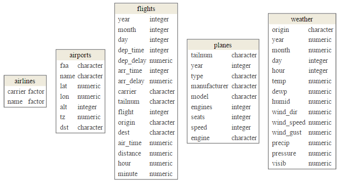
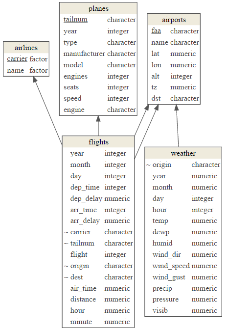
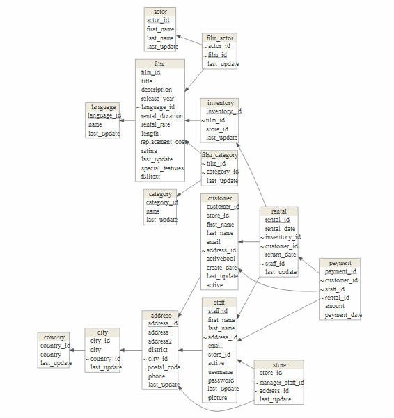
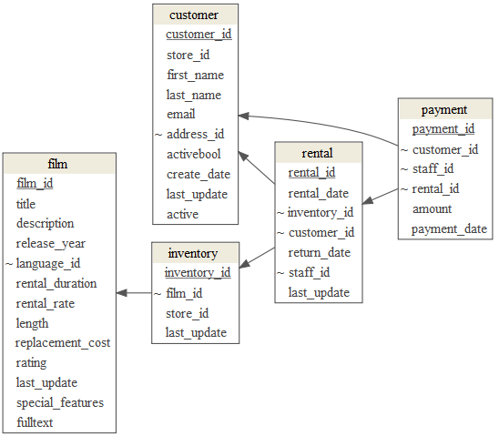
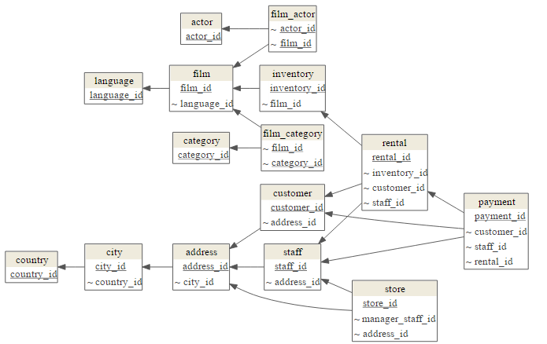
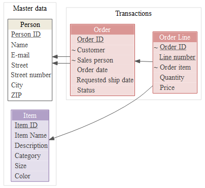
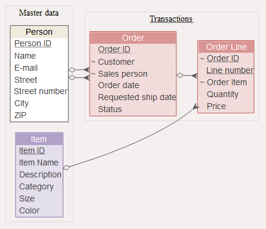
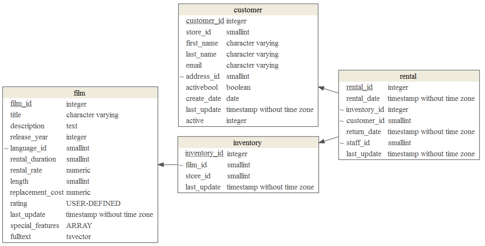

# datamodelr

Define and display data model diagrams:

* __Data model definition__
    + Define data model manually with [YAML](#model-definition-in-yaml)
    + Extract data model from [R data frames](#model-diagram-of-interconnected-data-frames)
    + Reverse-engineer [SQL Server Database](#reverse-engineer-sql-server-database)
    + Reverse-engineer [PostgreSQL Database](#reverse-engineer-postgresql-database)

* __Rendering__
    + Define model [segments](#diagram-segments)
    + Display [focused sub-diagram ](#focused-data-model-diagram) or
    + [Hide columns](#hide-columns) to improve model diagram readability
    + Use [colors](#colors) to emphasize specific tables
    + Define [graph direction](#graph-direction) or 
      other [graphviz attributes](#graphviz-attributes)
    + Display [additional column attributes](#additional-column-attributes)

Use [shiny](#shiny-application) to implement interactive model definition and 
rendering.

## Installation


```r
devtools::install_github("bergant/datamodelr")
```


## Usage


### Model Definition in YAML


Define a data model in YAML:

```yaml
# data model segments

- segment: &md Master data
- segment: &tran Transactions

# Tables and columns

- table: Person
  segment: *md
  columns:
    Person ID: {key: yes}
    Name:
    E-mail:
    Street:
    Street number:
    City:
    ZIP:

- table: Order
  segment: *tran
  columns:
    Order ID: {key: yes}
    Customer: {ref: Person}
    Sales person: {ref: Person}
    Order date:
    Requested ship date:
    Status:

- table: Order Line
  segment: *tran
  columns:
    Order ID: {key: yes, ref: Order}
    Line number: {key: yes}
    Order item: {ref: Item}
    Quantity:
    Price:

- table: Item
  segment: *md
  display: accent1
  columns:
    Item ID: {key: yes}
    Item Name:
    Description:
    Category:
    Size:
    Color:
```

Create a data model object with `dm_read_yaml`:


```r
library(datamodelr)
file_path <- system.file("samples/example.yml", package = "datamodelr")
dm <- dm_read_yaml(file_path)
```

Create a graph object to plot the model:


```r
graph <- dm_create_graph(dm, rankdir = "BT")
dm_render_graph(graph)
```

### Model Diagram of Interconnected Data Frames
Attach flights database 
([nycflights13](http://github.com/hadley/nycflights13#nycflights13) package) 
and create a data model from data frames:

```r
library("nycflights13")
dm_f <- dm_from_data_frames(flights, airlines, weather, airports, planes)
```

Create plot:

```r
graph <- dm_create_graph(dm_f, rankdir = "BT", col_attr = c("column", "type"))
dm_render_graph(graph)
```



Add references and primary keys:

```r
dm_f <- dm_add_references(
  dm_f,
  
  flights$carrier == airlines$carrier,
  flights$origin == airports$faa,
  flights$dest == airports$faa,
  flights$tailnum == planes$tailnum,
  weather$origin == airports$faa
)
graph <- dm_create_graph(dm_f, rankdir = "BT", col_attr = c("column", "type"))
dm_render_graph(graph)
```



### Reverse-engineer SQL Server Database

This example uses [Northwind](https://northwinddatabase.codeplex.com/) sample
database and [RODBC](http://CRAN.R-project.org/package=RODBC) 
package as an interface to SQL Server.


```r
library(RODBC)
con <- odbcConnect(dsn = "NW")
sQuery <- dm_re_query("sqlserver")
dm_northwind <- sqlQuery(con, sQuery, stringsAsFactors = FALSE, errors=TRUE)
odbcClose(con)

# convert to a data model
dm_northwind <- as.data_model(dm_northwind)
```

Plot the result:


```r
graph <- dm_create_graph(dm_northwind, rankdir = "BT")
dm_render_graph(graph)
```


### Reverse-engineer PostgreSQL Database

This example uses [DVD Rental](http://www.postgresqltutorial.com/postgresql-sample-database/) 
sample database and [RPostgreSQL](https://cran.r-project.org/package=RPostgreSQL) 
package as an interface to PostgreSQL database. 


```r
library(RPostgreSQL)
#> Loading required package: DBI
con <- dbConnect(dbDriver("PostgreSQL"), dbname="dvdrental", user ="postgres")
sQuery <- dm_re_query("postgres")
dm_dvdrental <- dbGetQuery(con, sQuery) 
dbDisconnect(con)
#> [1] TRUE

dm_dvdrental <- as.data_model(dm_dvdrental)
```

Show model:

```r
graph <- dm_create_graph(dm_dvdrental, rankdir = "RL")
dm_render_graph(graph)
```



### Focused Data Model Diagram

To focus in on a few tables from your model use `focus` attribute in `dm_create_graph` function:

```r
focus <- list(tables = c(
    "customer",
    "payment", 
    "rental",
    "inventory",
    "film"
))
    
graph <- dm_create_graph( dm_dvdrental, rankdir = "RL", focus = focus)
dm_render_graph(graph)
```



### Hide columns
To emphasize table relations and hide the "non-key"" 
columns use `view_type = "keys_only"`:


```r
graph <- dm_create_graph(dm_dvdrental, view_type = "keys_only", rankdir = "RL")
dm_render_graph(graph)
```



### Diagram Segments
Arrange tables in clusters with `dm_set_segment` function: 


```r
table_segments <- list(
  Transactions = c("rental", "inventory", "payment"),
  Party = c("customer", "staff", "address", "city", "country", "store"),
  Film = c("film", "film_actor", "actor", "language", "film_category", "category") )

dm_dvdrental_seg <- dm_set_segment(dm_dvdrental, table_segments)
```

Render diagram with segments:

```r
graph <- dm_create_graph(dm_dvdrental_seg, rankdir = "RL", view_type = "keys_only")
dm_render_graph(graph)
```


### Graph Direction
Use `rankdir` to change the direction of graph:


```r
graph <- dm_create_graph(dm_dvdrental_seg, rankdir = "BT", view_type = "keys_only")
dm_render_graph(graph)
```


### Colors
To emphasise tables with colors use `dm_set_display` function:


```r
display <- list(
  accent1 = c("rental", "payment"),
  accent2 = c("customer"),
  accent3 = c("staff", "store"),
  accent4 = c("film", "actor") )

dm_dvdrental_col <- dm_set_display(dm_dvdrental_seg, display)
graph <- dm_create_graph(dm_dvdrental_col, rankdir = "BT", view_type = "keys_only")
dm_render_graph(graph)
```


Default color scheme includes: 


### Custom Colors
Add your colors with `dm_add_colors` function:

```r
my_colors <-
  dm_color_scheme(
    purple = dm_palette(
      line_color = "#8064A2",
      header_bgcolor = "#B1A0C7",
      header_font = "#FFFFFF",
      bgcolor = "#E4DFEC"
    ),
    red = dm_palette(
      line_color = "#C0504D",
      header_bgcolor = "#DA9694",
      header_font = "#FFFFFF",
      bgcolor = "#F2DCDB"
    )
)

dm_add_colors(my_colors)

dm <- dm_set_display(dm, display = list(
  red = c("Order", "Order Line"),
  purple = "Item"
))

graph <- dm_create_graph(dm, rankdir = "RL")
dm_render_graph(graph)

```



### Graphviz Attributes
To change general graph, node or edge
[graphviz](http://www.graphviz.org/doc/info/attrs.html) 
attributes use `graph_attrs`, `edge_attrs` and `node_attrs` arguments
when creating graph.  This example changes
graph background,
arrow style (edge attribute) and 
font (node attribute):


```r
graph <- dm_create_graph( 
  dm, 
  graph_attrs = "rankdir = RL, bgcolor = '#F4F0EF' ", 
  edge_attrs = "dir = both, arrowtail = crow, arrowhead = odiamond",
  node_attrs = "fontname = 'Arial'")
                          
dm_render_graph(graph)
```



### Additional Column Attributes
To include additional column attributes set `col_attr` when creating graph:


```r
focus <- list(tables = c(
    "customer",
    "rental",
    "inventory",
    "film"
))
    
graph <- dm_create_graph( dm_dvdrental, rankdir = "RL", focus = focus,
                          col_attr = c("column", "type"))
dm_render_graph(graph)
```



### Shiny Application
Try **datamodelr** Shiny application:


```r
shiny::runApp(system.file("shiny", package = "datamodelr"))
```


## Utilised Packages 
datamodelr depends on:

* [DiagrammeR](http://rich-iannone.github.io/DiagrammeR/) for graph rendering
* [yaml](https://github.com/viking/r-yaml) for parsing YAML files in R
* RStudio [shiny](http://shiny.rstudio.com/) and
   [shinyAce](http://trestletech.github.io/shinyAce/) for shiny application demo.


