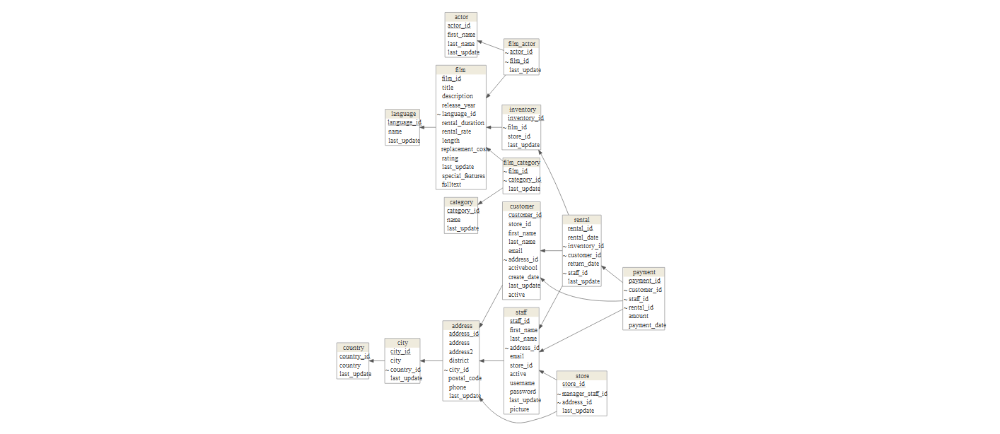

# datamodelr
Data model diagrams with DiagrammeR

## Installation


```r
devtools::install_github("bergant/datamodelr")
```


## Usage

### Model Definition in YAML

Define a data model in YAML:

```yaml
# data model segments

- segment: &md Master data
- segment: &tran Transactions

# Tables and columns

- table: Person
  segment: *md
  columns:
    Person ID: {key: yes}
    Name:
    E-mail:
    Street:
    Street number:
    City:
    ZIP:

- table: Order
  segment: *tran
  columns:
    Order ID: {key: yes}
    Customer: {ref: Person}
    Sales person: {ref: Person}
    Order date:
    Requested ship date:
    Status:

- table: Order Line
  segment: *tran
  columns:
    Order ID: {key: yes, ref: Order}
    Line number: {key: yes}
    Order item: {ref: Item}
    Quantity:
    Price:

- table: Item
  segment: *md
  columns:
    Item ID: {key: yes}
    Item Name:
    Description:
    Category:
    Size:
    Color:
```

Create a data model object with `dm_read_yaml`:


```r
library(datamodelr)
file_path <- system.file("samples/example.yml", package = "datamodelr")

dm <- dm_read_yaml(file_path)
```

Create a [DiagrammeR](https://cran.r-project.org/package=DiagrammeR) graph object
to plot the model:


```r
graph <- dm_create_graph(dm, rankdir = "RL")

dm_render_graph(graph)
```


### Reverse-engineer an Existing Database

This example is using [RODBC](http://CRAN.R-project.org/package=RODBC) 
package to get the information about 
the good old [Northwind database](https://northwinddatabase.codeplex.com/) 
from SQL Server Express.


```r
library(RODBC)

# Find the right connection string for your database:
con <- 
  odbcDriverConnect(
    "Driver={SQL Server}; Server=NB-DARKOB\\SQLEXPRESS; Database=Northwind")

# Select tables, columns, primary and foreign keys:
sQuery <- dm_re_query("sqlserver")
dm_northwind <- sqlQuery(con, sQuery, stringsAsFactors = FALSE, errors=TRUE)
odbcClose(con)

# convert to a data model
dm_northwind <- as.data_model(dm_northwind)
```

Plot the result:


```r
nw_graph <- dm_create_graph(dm_northwind, rankdir = "BT")

dm_render_graph(nw_graph)
```


### PostgreSQL Example


```r

library(RPostgreSQL)
con <- dbConnect(dbDriver("PostgreSQL"), dbname="dvdrental", user ="postgres")
sQuery <- dm_re_query("postgres")
dm_dvdrental <- dbGetQuery(con, sQuery) 
dbDisconnect(con)

dm_dvdrental <- as.data_model(dm_dvdrental)
dvd_graph <- dm_create_graph(dm_dvdrental, rankdir = "RL")
dm_render_graph(dvd_graph)
```



