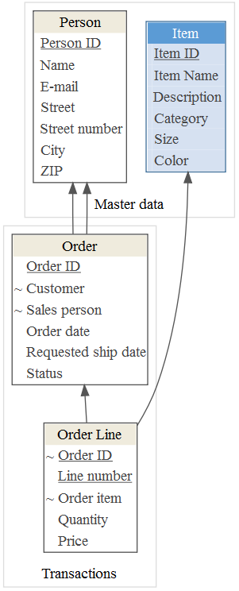
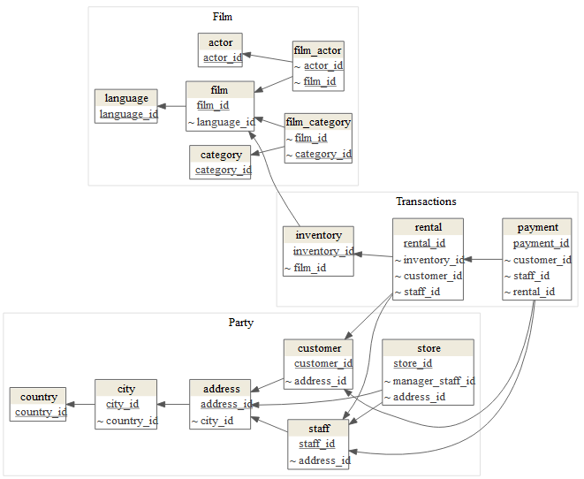
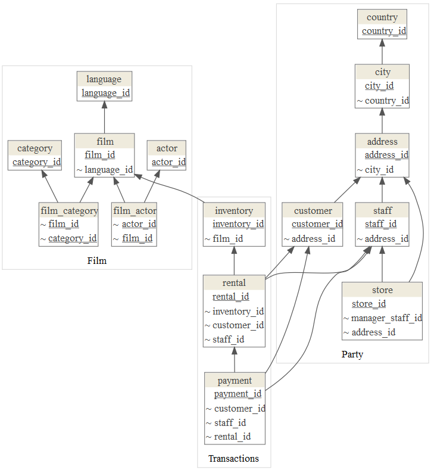

# datamodelr
Data model diagrams with [DiagrammeR](https://cran.r-project.org/package=DiagrammeR)

## Installation


```r
devtools::install_github("bergant/datamodelr")
```


## Usage

### Model Definition in YAML

Define a data model in YAML:

```yaml
# data model segments

- segment: &md Master data
- segment: &tran Transactions

# Tables and columns

- table: Person
  segment: *md
  columns:
    Person ID: {key: yes}
    Name:
    E-mail:
    Street:
    Street number:
    City:
    ZIP:

- table: Order
  segment: *tran
  columns:
    Order ID: {key: yes}
    Customer: {ref: Person}
    Sales person: {ref: Person}
    Order date:
    Requested ship date:
    Status:

- table: Order Line
  segment: *tran
  columns:
    Order ID: {key: yes, ref: Order}
    Line number: {key: yes}
    Order item: {ref: Item}
    Quantity:
    Price:

- table: Item
  segment: *md
  columns:
    Item ID: {key: yes}
    Item Name:
    Description:
    Category:
    Size:
    Color:
```

Create a data model object with `dm_read_yaml`:


```r
library(datamodelr)
file_path <- system.file("samples/example.yml", package = "datamodelr")

dm <- dm_read_yaml(file_path)
```

Create a graph object to plot the model:


```r
graph <- dm_create_graph(dm, rankdir = "RL")
dm_render_graph(graph)
```


### Reverse-engineer an Existing Database

This example uses [Northwind](https://northwinddatabase.codeplex.com/) sample
database and [RODBC](http://CRAN.R-project.org/package=RODBC) 
package as an interface to SQL Server.


```r
library(RODBC)
con <- odbcConnect(dsn = "NW")
sQuery <- dm_re_query("sqlserver")
dm_northwind <- sqlQuery(con, sQuery, stringsAsFactors = FALSE, errors=TRUE)
odbcClose(con)

# convert to a data model
dm_northwind <- as.data_model(dm_northwind)
```

Plot the result:


```r
graph <- dm_create_graph(dm_northwind, rankdir = "BT")
dm_render_graph(graph)
```


### PostgreSQL Example

This example uses [DVD Rental](http://www.postgresqltutorial.com/postgresql-sample-database/) 
sample database and [RPostgreSQL](https://cran.r-project.org/package=RPostgreSQL) 
package as an interface to PostgreSQL database. 


```r
library(RPostgreSQL)
#> Loading required package: DBI
con <- dbConnect(dbDriver("PostgreSQL"), dbname="dvdrental", user ="postgres")
sQuery <- dm_re_query("postgres")
dm_dvdrental <- dbGetQuery(con, sQuery) 
dbDisconnect(con)
#> [1] TRUE

dm_dvdrental <- as.data_model(dm_dvdrental)
```

Show model:

```r
graph <- dm_create_graph(dm_dvdrental, rankdir = "RL")
dm_render_graph(graph)
```


### Focused Data Model Diagram

To focus in on a few tables from your model use `focus` attribute in `dm_create_graph` function:

```r
focus <- list(tables = c(
    "customer",
    "payment", 
    "rental",
    "inventory",
    "film"
))
    
graph <- dm_create_graph( dm_dvdrental, rankdir = "RL", focus = focus)
dm_render_graph(graph)
```


### Reduce Detail
To emphasize the table relations use `view_type = "keys_only"`:


```r
graph <- dm_create_graph(dm_dvdrental, view_type = "keys_only", rankdir = "RL")
dm_render_graph(graph)
```


### Diagram Segments
To arrange tables in clusters with `dm_set_segment` function: 


```r
table_segments <- list(
  Transactions = c("rental", "inventory", "payment"),
  Party = c("customer", "staff", "address", "city", "country", "store"),
  Film = c("film", "film_actor", "actor", "language", "film_category", "category") )

dm_dvdrental_seg <- dm_set_segment(dm_dvdrental, table_segments)
```

A clustered diagram:

```r
graph <- dm_create_graph(dm_dvdrental_seg, rankdir = "RL", view_type = "keys_only")
dm_render_graph(graph)

```



### Graph Direction
Use `rankdir` to change the direction of graph:


```r
graph <- dm_create_graph(dm_dvdrental_seg, rankdir = "BT", view_type = "keys_only")
dm_render_graph(graph)
```




