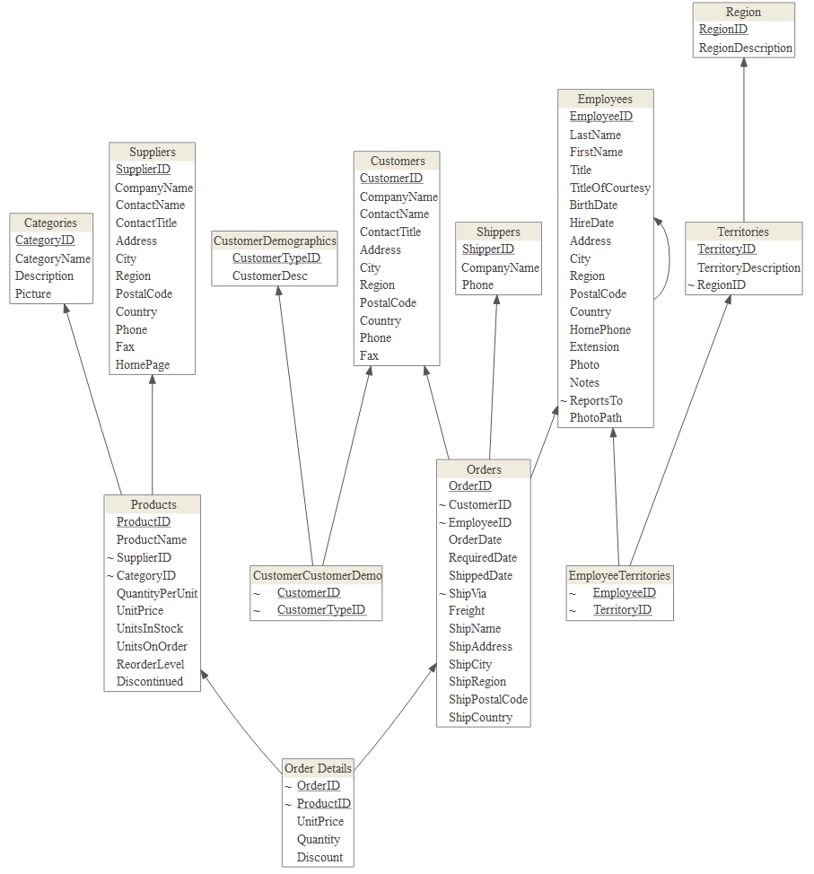

# datamodelr
Data model diagrams with DiagrammeR

## 1. How to create a new model

### 1.1 Define your data model in YAML

```yaml
# master data
Person:
  Person ID: {key: yes}
  Name:
  E-mail:
  Street:
  Street number:
  City:
  ZIP:

# Product setup
Item:
  Item ID: {key: yes}
  Item Name:
  Description:
  Category:
  Size:
  Color:
  
# transactions
Order:
  Order ID: {key: yes}
  Customer: {ref: Person}
  Sales person: {ref: Person}
  Order date:
  Requested ship date:
  Status:

Order Line:
  Order ID: {key: yes, ref: Order}
  Line number: {key: yes}
  Order item: {ref: Item}
  Quantity:
  Price:

```

### 1.2. Create data model object


```r
library(datamodelr)
file_path <- system.file("models/example.yml", package = "datamodelr")

dm <- dm_read_yaml(file_path)
```

### 1.3. Create DiagrammeR graph object


```r
graph <- dm_graph(dm, rankdir = "LR", use_ref_ports = TRUE)

DiagrammeR::render_graph(graph)
```


## 2. Reverse-engineer an existing database

### 2.1. Get the information about the model

This example is using [RODBC](http://CRAN.R-project.org/package=RODBC) 
package to get the information about 
the good old [Northwind database](https://northwinddatabase.codeplex.com/) 
from SQL Server.


```r
library(RODBC)

# Find the right connection string for your database:
con <- odbcDriverConnect(
  "Driver={SQL Server}; Server=NB-DARKOB\\SQLEXPRESS; Database=Northwind")

# Select tables, columns, primary and foreign keys:
sQuery <-
  "
  select
    tabs.name as [table],
    cols.name as [column],
    isnull(ind_col.column_id, 0) as [key],
    OBJECT_NAME (ref.referenced_object_id) AS ref,
    COL_NAME (ref.referenced_object_id, ref.referenced_column_id) AS ref_col,
    types.name as [type],
    cols.max_length,
    cols.precision,
    cols.scale
  from
    sys.all_columns cols
      inner join sys.tables tabs on
      cols.object_id = tabs.object_id
    left outer join sys.foreign_key_columns ref on
      ref.parent_object_id = tabs.object_id
      and ref.parent_column_id = cols.column_id
    left outer join sys.indexes ind on
      ind.object_id = tabs.object_id
      and ind.is_primary_key = 1
    left outer join sys.index_columns ind_col on
      ind_col.object_id = ind.object_id
      and ind_col.index_id = ind.index_id
      and ind_col.column_id = cols.column_id
    left outer join sys.systypes [types] on
      types.xusertype = cols.system_type_id
  order by
    tabs.create_date,
    cols.column_id
  "


dm_northwind <- sqlQuery(con, sQuery, stringsAsFactors = FALSE, errors=TRUE)
odbcClose(con)

dm_northwind[1:6, 1:7]
#>       table          column key  ref ref_col     type max_length
#> 1 Employees      EmployeeID   1 <NA>    <NA>      int          4
#> 2 Employees        LastName   0 <NA>    <NA> nvarchar         40
#> 3 Employees       FirstName   0 <NA>    <NA> nvarchar         20
#> 4 Employees           Title   0 <NA>    <NA> nvarchar         60
#> 5 Employees TitleOfCourtesy   0 <NA>    <NA> nvarchar         50
#> 6 Employees       BirthDate   0 <NA>    <NA> datetime          8
```

Data frame with elements:

* table
* column
* key
* ref
* ...

can be coerced directly to a data model object:


```r
dm_northwind <- as.data_model(dm_northwind)
```

Plot the result:

```r
nw_graph <- dm_graph(dm_northwind, rankdir = "BT", use_ref_ports = FALSE)

DiagrammeR::render_graph(nw_graph)
```


